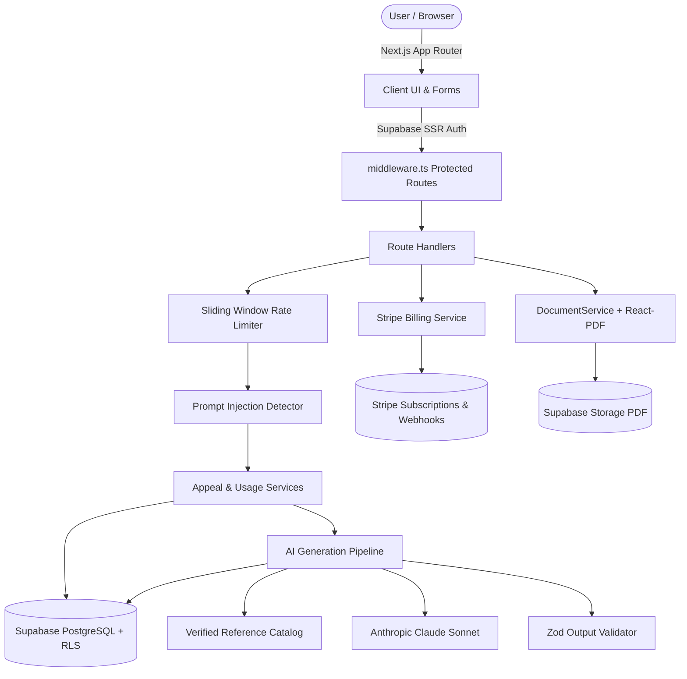

# ClaimAppeal AI ⚖️🏥

[](https://github.com/trivedi-stan/claimappeal-ai/actions/workflows/ci.yml)
[](https://nextjs.org/)
[](https://www.typescriptlang.org/)
[](https://tailwindcss.com/)
[](https://supabase.com/)
[](#license)

**ClaimAppeal AI** is a specialized, production-ready web platform that transforms structured insurance denial information into professional, legally grounded health insurance appeal letters using LLMs with strict anti-hallucination safety guardrails.

Built for both **B2C patients** navigating denied claims and **B2B medical billing teams/providers** in the United States.

---

## 🚀 Key Features

- **Guided 7-Step Intake Wizard:**
  - Patient demographics & contact information
  - Insurance carrier, plan type, and member ID
  - Claim details (CPT codes, ICD-10 diagnosis codes, billed & denied amounts)
  - Denial reason codes (e.g., CO-50 Medical Necessity, CO-16 Prior Authorization)
  - Clinical narrative, physician justifications, and prior attempt tracking
  - Autosave state persistence across steps
- **Grounded AI Generation Engine:**
  - Powered by Claude 3.5 / 3.7 / Sonnet through a clean provider abstraction
  - Strict anti-hallucination guardrails: zero fabrication of clinical facts or policy terms
  - Controlled citation catalog: only verified legal and regulatory references (ERISA § 503, ACA § 2719, No Surprises Act)
  - Mandatory AI draft disclaimer watermark and footers
- **Interactive Review & Version History:**
  - Rich inline editing of generated appeal letters
  - Strategy breakdowns and custom checklist of recommended supporting clinical records
  - Multi-version history allowing users to regenerate and compare iterations
- **Letterhead-Quality PDF Export:**
  - Vector PDF compilation via `@react-pdf/renderer`
  - Print-ready format suitable for physical mailing or electronic submission
- **Tiered Stripe Subscriptions & Metering:**
  - Free (3 generations/month), Pro ($29/month, 25 generations), Business ($99/month, 100 generations)
  - Stripe Checkout, Customer Portal, and idempotent webhook synchronization
  - Real-time monthly usage metering and quota enforcement
- **Enterprise-Grade Security Hardening:**
  - In-memory sliding-window rate limiting on all API routes and AI endpoints
  - Automated prompt injection scanning and Unicode/control character sanitization
  - Strict PostgreSQL Row Level Security (RLS) ensuring total multi-tenant data isolation
  - Full admin dashboard (`/admin`) for platform metrics, active appeals, and AI cost tracking

---

## 🏗️ System Architecture



---

## 🛠️ Tech Stack

| Layer | Technology |
|---|---|
| **Framework** | Next.js 15.3.4 (App Router) |
| **Language** | TypeScript 5.8 (Strict Mode) |
| **Styling** | Vanilla Tailwind CSS 3.4 + Radix UI Primitives + Lucide Icons |
| **Database & Auth** | Supabase (PostgreSQL with RLS + SSR Auth) |
| **LLM Provider** | Anthropic Claude SDK (`@anthropic-ai/sdk`) |
| **Payments** | Stripe (`stripe` + `@stripe/stripe-js`) |
| **PDF Generation** | `@react-pdf/renderer` |
| **Testing** | Jest + React Testing Library + Playwright E2E |
| **CI/CD** | GitHub Actions |

---

## 🏁 Getting Started

### Prerequisites

- [Node.js](https://nodejs.org/) v20.x or higher
- [npm](https://www.npmjs.com/) v10.x or higher
- A [Supabase](https://supabase.com/) project
- An [Anthropic](https://console.anthropic.com/) API account
- A [Stripe](https://stripe.com/) account (Test mode supported)

### 1. Clone the Repository

```bash
git clone https://github.com/trivedi-stan/claimappeal-ai.git
cd claimappeal-ai
```

### 2. Install Dependencies

```bash
npm install
```

### 3. Configure Environment Variables

Copy the example environment configuration:

```bash
cp .env.example .env.local
```

Fill in the required values in `.env.local`:

```env
# Supabase
NEXT_PUBLIC_SUPABASE_URL=https://your-project.supabase.co
NEXT_PUBLIC_SUPABASE_ANON_KEY=your-supabase-anon-key
SUPABASE_SERVICE_ROLE_KEY=your-supabase-service-role-key

# Stripe
STRIPE_SECRET_KEY=sk_test_your-stripe-secret-key
STRIPE_WEBHOOK_SECRET=whsec_your-webhook-secret
NEXT_PUBLIC_STRIPE_PUBLISHABLE_KEY=pk_test_your-publishable-key

# AI Provider
AI_PROVIDER=anthropic
AI_MODEL=claude-sonnet-4-6
ANTHROPIC_API_KEY=sk-ant-your-anthropic-key

# Resend / Email
RESEND_API_KEY=re_your-resend-key
EMAIL_FROM=noreply@yourdomain.com

# App
NEXT_PUBLIC_APP_URL=http://localhost:3000
ADMIN_EMAILS=admin@yourdomain.com
```

### 4. Database Setup

Execute the schema migrations and seed data in your Supabase SQL Editor:

1. `supabase/migrations/001_initial_schema.sql` (Creates all 12 tables + RLS policies)
2. `supabase/seed.sql` (Seeds verified ERISA, ACA, and No Surprises Act references)

### 5. Run the Development Server

```bash
npm run dev
```

Open [http://localhost:3000](http://localhost:3000) in your browser.

---

## 🧪 Testing & Validation

The codebase maintains automated unit and integration tests:

```bash
# Run unit & integration test suite (26 tests)
npm run test

# Run tests with coverage
npm run test -- --coverage

# Type checking
npm run type-check

# Linting
npm run lint

# Production build verification
npm run build
```

---

## 📁 Directory Structure

```
claimappeal-ai/
├── app/
│   ├── (auth)/                # Login, Signup, Password Reset routes
│   ├── (dashboard)/           # Dashboard, Wizard, Review, Versions, Settings
│   ├── (marketing)/           # Landing page and Pricing comparison
│   ├── admin/                 # Admin KPI & AI telemetry dashboard
│   ├── api/                   # REST API routes (appeals, billing, auth, pdf)
│   ├── globals.css            # Custom design tokens and styles
│   └── layout.tsx             # Root layout and theme providers
├── components/
│   ├── pdf/                   # React-PDF letterhead template
│   └── ui/                    # UI primitives (buttons, modals, inputs)
├── config/
│   └── plans.ts               # Subscription tiers and quota configurations
├── lib/
│   ├── ai/                    # Anthropic provider, prompt builder, normalizer, validator
│   ├── security/              # Rate limiter and prompt injection sanitizer
│   ├── stripe/                # Stripe client and webhook processing
│   ├── supabase/              # Client, server, and admin Supabase instances
│   └── utils.ts               # Formatting, styling, and general helpers
├── schemas/                   # Shared Zod validation schemas
├── services/                  # Business logic (appeals, AI, billing, usage, docs)
├── supabase/
│   ├── migrations/            # SQL migration scripts with RLS
│   └── seed.sql               # Verified regulatory reference seed data
├── tests/
│   ├── e2e/                   # Playwright E2E user flows
│   ├── integration/           # Schema and API validation tests
│   └── unit/                  # Normalizer, prompt builder, rate limiter tests
├── .github/workflows/ci.yml   # Continuous Integration pipeline
└── package.json
```

---

## 🔒 Security & Medical Disclaimer

- **Medical & Legal Advice:** ClaimAppeal AI is an administrative drafting tool and does not provide legal or medical advice. All generated appeal drafts should be reviewed by licensed medical professionals or qualified advocates before official submission.
- **HIPAA Compliance Notice:** This repository represents an MVP. In accordance with PRD guidance, do not market this solution as "HIPAA Compliant" in production without formal security audits, third-party compliance reviews, and executed Business Associate Agreements (BAAs) with all downstream cloud vendors.

---

## 📄 License

Proprietary. All rights reserved.
